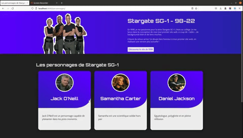

# Stargate SG-1 ( 98 22 ) - V 0.0.1

 
 
 
 

## Niveau technique

**IMPORTANT** : Ce projet me sert à découvrir les fondements de Django. Je débute depuis peu : ce projet sera amélioré à chacune de mes montées en compétence avec ce framework.

## Contexte du projet

Lorsque j'avais 14 ans, je découvre le HTML grâce à un livre qui promettait de créer une page web en 1 jour. Serait-ce le premier bootcamp de l'histoire du web ? Je me lance donc, et je réalise ce premier site à l'aide d'un simple bloc note (je n'avais pas connaissance à l'époque des éditeurs de code) et de l'hébergement gratuit des pages persos de free. 

Les années passent, et je constate que le site est toujours en ligne. Ceci me fait sourire.

Puis je deviens véritablement développeuse. Alors oui, je pense avec nostalgie à ce site, ce premier site. Je voulais lui rendre honneur en lui offrant une sorte de V2 aux stéroïdes. Si en 1998 j'ai découvert le HTML grâce à lui, en 2022 je découvrirai Django grâce à lui. 


## Concrètement que fait Stargate SG-1 98-22 ?

Ce site présente simplement des informations relatives à la série TV Stargate SG-1. 

## Screenshots du projet





## Stack Technique (prérequis) 

 
 


Django : https://www.djangoproject.com/

Python : https://www.python.org/

Git : https://git-scm.com/downloads


## Installer le projet 


1. Télécharger le repo sur votre machine

```bash
git clone <url du repo>
```

2. Compilation pour le développement
```
python3 manage.py runserve
```

